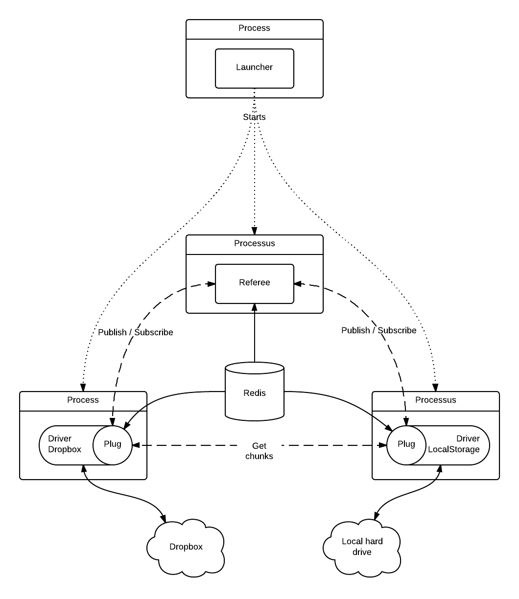

=================================
Getting started
=================================

Onitu at a glance
==================

Onitu must deal with a lot of events coming from different places. Therefore, Onitu is build around an asynchrony model. Each part runs in a separate process, and communicate with the rest via ZeroMQ messages and Redis.

In order to synchronize files between external services, Onitu uses a system of drivers. You can find more information about this system in :doc:`drivers`. Each driver send events and receive orders from the :class:`.Referee`, which choose where the files should be synchronised according to the configuration rules.

Global architecture
===================

   A schema illustrating the global architecture of Onitu with two drivers.

Dependencies
============
The core of Onitu uses several libraries (other dependencies exists but are specific to some drivers) :

Circus_
  Used to start, manage and monitor the different processes

PyZMQ_
  A binding of the ZeroMQ library for the Python language

`redis-py`_
  A library to communicate with Redis in Python

Logbook_
  A powerful logging library that allows Onitu to log on a ZeroMQ channel, aggregating all the logs in the same place

.. _Circus: http://circus.readthedocs.org
.. _PyZMQ: http://github.com/zeromq/pyzmq
.. _redis-py: http://github.com/andymccurdy/redis-py
.. _Logbook: http://pythonhosted.org/Logbook/

Technical choices
=================

We made some difficult technical choices in order to build Onitu in the most maintainable and efficient way. Those choices can be questionable, but here are our motivations :

Python
------

Python is a general-purpose and flexible language. This was our first choice, as we were all already using it and loving it. It allows us to distribute Onitu easily, without having to compile the sources or distribute binaries. Python is available in a lot of different systems, has a lot of built-in functionalities, and is easy to understand and read.

You might have some concerns regarding the speed, but Onitu is an I/O bound application, so most of the time it is not executing Python code but downloading/uploading files or exchanging information over sockets. The same program with a low-level language like C would introduce a lot of complexity, and probably a very small performance amelioration.

ZeroMQ
------

As Onitu is an application with a lot of different processes and threads, we need a way to communicate between them. ZeroMQ is a layer on top of IP and Unix sockets, and provides messaging patterns. Onitu uses several of them, like ROUTER/DEALER, PUBLISH/SUBSCRIBE and REQUEST/REPLY.

ZeroMQ is really fast, available on a lot of platforms and have a Python binding. It is much more flexible and lightweight than other message brockers, like RabbitMQ or ActiveMQ.

Redis
-----

Onitu needs to store some informations in a persistent database. This database should be cross-platforms, schema-less and easy to install and maintain. For that purpose, Redis has been chosen. But Redis is not available in the same version in all platforms, and is not really persistent. Also, the entire database is in-memory, limiting its size. Therefore, another solution will soon be chosen to replace it, as it is not the perfect solution.
